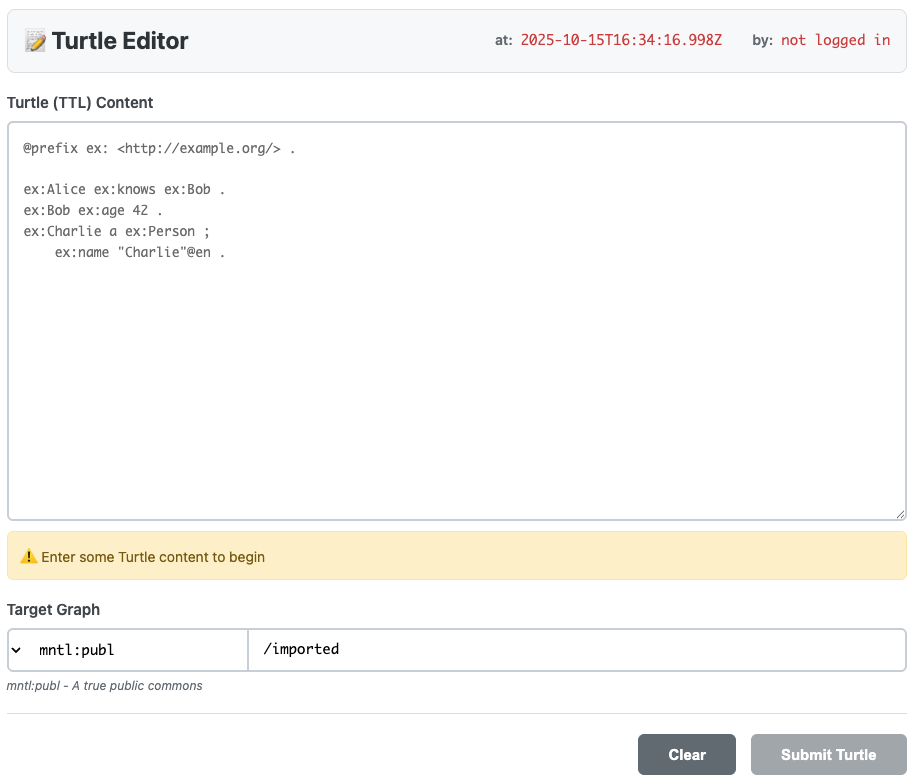

# ttl-editor-form

A standalone web component for bulk Turtle (TTL) ingestion into MMM.



## Features

- 🎯 **Bulk TTL ingestion** - Paste or type Turtle directly
- 📝 **Live validation** - Parse-on-the-fly with error highlighting
- 🎛️ **Mental space selection** - Uses mntl-space-fab component
- 🔒 **Authentication aware** - Submit only when authenticated
- ✨ **Simple UX** - Clean, focused interface

## Installation

### For Development (using npm link)

```bash
# First, link mntl-space-fab
cd ~/REPOS/mntl-space-fab
npm install
npm link

# Then setup ttl-editor-form
cd ~/REPOS/ttl-editor-form
npm install
npm link @mmmlib/mntl-space-fab
```

### For Production (using GitHub)

The package.json already references GitHub:

```json
{
  "dependencies": {
    "n3": "^1.17.2",
    "@mmmlib/mntl-space-fab": "github:smurp/mntl-space-fab#main"
  }
}
```

Then:

```bash
npm install
```

## Development Workflow

Since these packages are under active development in ~/REPOS:

```bash
# Initial setup
cd ~/REPOS/mntl-space-fab && npm install && npm link
cd ~/REPOS/ttl-editor-form && npm install && npm link @mmmlib/mntl-space-fab

# After making changes to mntl-space-fab
cd ~/REPOS/mntl-space-fab
# Changes are immediately available to ttl-editor-form via symlink

# Run dev server
cd ~/REPOS/ttl-editor-form
npm run dev
# Visit http://localhost:8002/example/
```

## Usage

```html
<script type="module" src="path/to/ttl-editor-form.js"></script>
<ttl-editor-form></ttl-editor-form>
```

```javascript
const form = document.querySelector('ttl-editor-form');
form.currentIdentity = 'mailto:alice@example.com';
form.acceptedTypes = [
  { value: 'mntl:open', label: 'mntl:open/{identity}',
    description: 'mntl:open - Owned by you, readable by the world' },
  { value: 'mntl:publ', label: 'mntl:publ',
    description: 'mntl:publ - A true public commons' }
];

form.addEventListener('ttl-submitted', (e) => {
  console.log(`Submitted ${e.detail.tripleCount} triples`);
});
```

## API Reference

### Properties

- `mmmServer` - MMMServer instance for direct submission
- `currentIdentity` - User identity (required for authentication)
- `defaultGraph` - Default graph URI (default: 'mntl:publ/imported')
- `acceptedTypes` - Array of mental space types

### Events

- `ttl-submitted` - Fired when TTL successfully submitted
  - `detail: { ttl, graph, at, by, tripleCount }`
- `validation-changed` - Fired when validation state changes
  - `detail: { valid, error?, tripleCount? }`
- `ttl-error` - Fired on submission error
  - `detail: { error }`

### Methods

- `clear()` - Clear the textarea and reset validation

## Component Loading

The ttl-editor-form uses **dynamic loading** for its dependency on `mntl-space-fab`:

- Automatically loads mntl-space-fab from `/mntl-space-fab/src/mntl-space-fab.js`
- Graceful fallback with error message if component can't load
- Requires MMM server to have registered the route: `app.use('/mntl-space-fab', ...)`

This matches the pattern used by quad-form for maximum portability across deployment contexts (browser, Electron, extensions, etc.).

## Server-Side Integration

The form expects a POST endpoint at `/mmm/api/ingest-ttl`:

```javascript
router.post('/api/ingest-ttl', async (req, res) => {
  const { ttl, graph, by } = req.body;
  
  try {
    const parser = new N3.Parser();
    const quads = parser.parse(ttl);
    
    // Convert to MMM format and ingest
    const results = await Promise.all(
      quads.map(quad => mmmServer.ingestFlat({
        s: quad.subject.value,
        p: quad.predicate.value,
        o: quad.object.value,
        g: graph,
        at: new Date().toISOString(),
        by: by,
        ...(quad.object.datatype && { d: quad.object.datatype.value }),
        ...(quad.object.language && { l: quad.object.language })
      }))
    );
    
    res.json({
      success: true,
      tripleCount: results.length,
      timestamp: new Date().toISOString()
    });
  } catch (error) {
    res.status(400).json({
      success: false,
      error: error.message
    });
  }
});
```

## License

AGPL-3.0-or-later